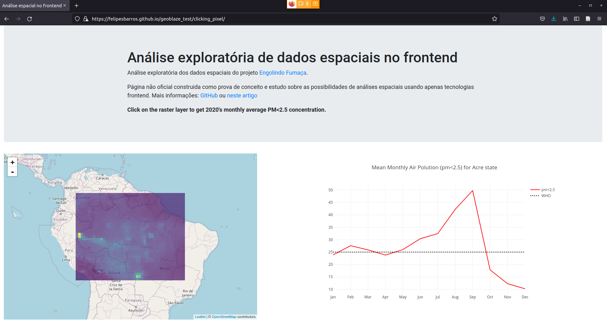
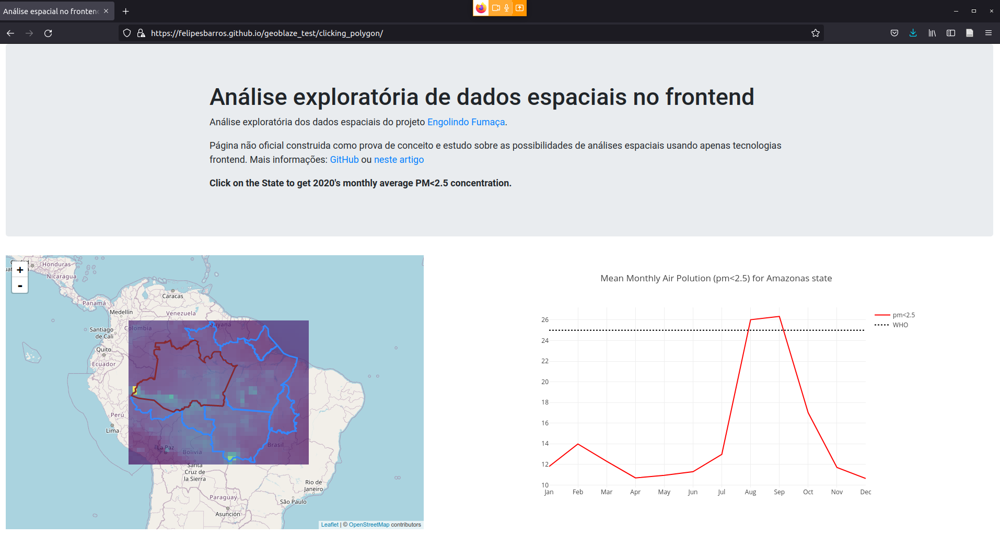

*Artigo publicado também no [linkedin](https://www.linkedin.com/pulse/an%C3%A1lise-espacial-frontend-felipe-sodr%C3%A9-mendes-barros/).*

Este ano pude participar do projeto de jornalismo de dados [Engolindo Fumaça](https://infoamazonia.org/project/engolindo-fumaca/), desenvolvido pelo [InfoAmazonia](https://infoamazonia.org/). Foi um projeto bem desafiador que me trouxe vários aprendizados. Muitos deles já viraram artigos, como os de cubo de dados.

Ainda que o projeto tenha sido um sucesso (inclusive, foi um dos finalistas do [prêmio de jornalismo de dados Cláudio Weber Abramo](https://premio.jornalismodedados.org/) ) alguns desafios ficaram pendentes. Um deles está com a possibilidade de apresentar dados raster em um sistema webmap, sem dispor de grande infraestrutura de SIG, como base de dados e servidor de mapas, PostGIS e geoserver, respectivamente. Afinal, após todo o processo de análise de dados e produção das matérias, era importante apresentar os dados de forma interativa.

Aliás, desenvolvimento de soluções com dados espaciais com infraestrutura limitada tem sido um tema explorado por mim em [alguns artigos](https://felipesbarros.github.io/pt/).

Então, em resumo, a necessidade era: apresentar as imagens de satélite utilizadas nas reportagens em um mapa dinâmico, sem depender de um servidor de mapas, para que os leitores da matéria pudessem explorar os dados. Algo similar a um dashboard.

Pois foi ao moderar uma sessão da conferência [Free and Open Source Software for Geospatial](https://2021.foss4g.org/) (#FOSS4G) deste ano que, sem querer, me deparei com as possíveis soluções. A solução seria transportar a responsabilidade de carregar, apresentar e calcular algumas estatísticas ao frontend, usando o conjunto de bibliotecas `georaster`, `georaster-layer-for-leaflet` e `geoblaze`. A apresentação que me dispertou para essas ferramentas foi feita pelo [Daniel Dufour](https://www.linkedin.com/in/danieljdufour) sobre o `geoblaze`.

* `georaster` é uma biblioteca JavaScript que nos permite carrregar, e até mesmo criar, dados raster a partir de objetos JavaScript;
* `georaster-layer-for-leaflet` é uma biblioteca que nos permite apresentar dados raster (a princípio geotif) nos mapas feitos em leaflet;
* `geoblaze` é um pacote desenvolvido em JavaScript para permitir analisar dados carregados como georaster.

Dessa forma, com essa stack the bibliotecas poderemos carregar uma imagem raster georreferenciada, extrair estatísticas gerais e espaciais, bem como aplicar alguns processamentos, como algebra de bandas e apresentá-las em um webmap `leaflet`. Tudo isso sem depender de uma infraestrutura de backend. Tudo sendo processado no frontend. Sim, essa solução pode ser limitada para alguns casos. Mas nem todos.

E, por isso, decidi explorar essa alternativa, ainda que frontend (e JavaScript) não seja a “minha praia”. A verdade é que não consegui conter o entusiasmo e parti para uma prova conceitual. [Compartilho a prova de conceito que fiz](https://observablehq.com/@felipesbarros/proof_of_concept_geoblaze), usando o [observablehq](https://observablehq.com/) (uma espécie de *jupyter-notebook* para programação frontend).

Aproveitei para consolidar o resultado em uma landingpage. Nela, além de apresentar o raster, foi possível garantir que o usuário possa interagir com o mesmo, de duas formas distintas:

* Clicando em um pixel;

* ou clicando em um dos polígonos que representam os limites dos estados que compõem a Amazônia Legal. (⚠️ não estamos representando o estado do Maranhão já que o mesmo não é contemplado integramente na Amazônia Legal);

Em ambas implementações os valores dos pixels são extraídos [just-in-time](https://pt.wikipedia.org/wiki/Just_in_time) e o gráfico em [plotly](https://plotly.com/) é atualizado representando o comportamento temporal dos mesmos. Tais dados se referem a [Material Particulado < 2.5](https://pt.wikipedia.org/wiki/Material_particulado) do ano de 2020. No gráfico, apresentamos, ainda, o valor máximo sugerido pela Organização Mundial da Saúde (*World Health Organization - WHO*).

Essas duas implementações visam explorar oportunidades diferentes das ferramentas em questão. Separamos os resultados em duas páginas diferentes: [clicando pixel a pixel](https://felipesbarros.github.io/geoblaze_test/clicking_pixel); [clicando num polígono](https://felipesbarros.github.io/geoblaze_test/clicking_polygon);

E, é lógico: tenho tudo [documentado no github](https://github.com/felipesbarros/geoblaze_test/).

Não posso deixar de mencionar que o projeto só foi possível com a ajuda do [Kyle Felipe](https://kylefelipe.com/) quem, inclusive, foi o responsável pela evolução do projeto implementando a solução em JS baseada na seleção de polígonos.

Espero que seja útil :)
