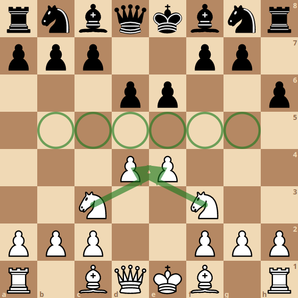

*Artigo publicado também na revista [HBNetwork](https://sites.google.com/view/revista-hbnetwork).*

Aviso antes que seja tarde: não sou formado na área de desenvolvimento, ainda que atue na área de análise de dados e como solucionador de problemas a partir do uso de programação. E tampouco sou um exímio jogador de xadrez. Com relação a este último ponto, como vocês devem se imaginar, estou com as centenas de milhares de pessoas que se permitiram aprender sobre esse lindo jogo depois de assistir à śerie “O gambito da rainha”. Contudo, não considero esses fatos como problema, já que o que pretendo fazer aqui é uma analogia entre o jogo de xadrez e nossa carreira profissional.

Sim, escrever este texto é uma ousadia de minha parte: além de estar fazendo uma analogia entre dois temas aos quais não me considero apto para tal, se trata apenas de um **exercício mental e hipotético**. Ciente disto, não terei a menor intenção de esgotar todas as possibilidades metafóricas, nem em tê-las como únicas e verdadeiras. A intenção do texto é, nada mais que convidá-los a pensar o nosso desenvolvimento profissional sob uma nova perspectiva, com o único objetivo de exercitar. Logo, não tenho dúvidas que algumas abordagens aqui adotadas deixarão alguns pontos sem explicação/solução.

Aviso dado, comento de onde surgiu a ideia: Sou formado em Geografia e, além de atuar nas áreas mencionadas antes, sou também professor de Geopolítica que, assim como os temas das relações internacionais, possui como metáfora principal o jogo do xadrez. Imagino que já tenham escutado algo como “o xadrez geopolítico no oriente médio”. Mas em que sentido, isso? Devo imaginar o presidente do Irã jogando xadrez contra o presidente do Iraque, onde as peças seriam recursos de seus respectivos países? Ou seria o caso de pensar o mundo como um imenso tabuleiro de xadrez onde cada país desempenha um papel e, neste caso, Irã e Iraque seriam algumas das peças em movimentos importantes? Pois é, ambas possibilidades são pertinentes.

Como até os menos instruídos no jogo já devem saber, cada peça possui habilidades diferentes de movimentação e captura de outras peças. Reconhecer essas diferentes habilidades é importante para sabermos até que ponto nossos colegas poderão nos dar cobertura em alguma movimentação arriscada ou quando será a nossa vez de fazê-lo para que outros se desenvolvam. Ou podemos, ainda, pensar em cada peça como as diferentes habilidades que temos o potencial de desenvolver. É importante conhecê-las, tentar desenvolvê-las mas sem cair em armadilhas.

E, só para constar, ainda que tenhamos um oponente ao jogar xadrez, não quero dar muita ênfase a ele nas analogias, para não cair numa visão rasa de que estamos lutando contra alguém, ainda que às vezes seja conveniente: você executa alguns movimentos buscando um objetivo (melhoria salarial, por exemplo) e não o alcança, pois o oponente simplesmente não moveu suas peças como você havia pensado, podendo, então, colocar culpa do seu fracasso no oponente.

Mas vamos ao que interessa: selecionei três conceitos básicos de xadrez a partir dos quais nos permitirão refletir sobre as possíveis abordagens de desenvolvimento pessoal e profissional:

**Peão promovido:** Uma iniciativa comum aos que não conhecem alguns conceitos básicos de estratégia é o de tentar a todo custo chegar com o peão ao outro lado do tabuleiro. Cruzando as 8 casas para, então, se tudo der certo, ter o seu peão promovido. Nessa promoção o peão pode se transformar em qualquer uma das outras peças (exceto rei e peão, não faria sentido, né?).

Seria leviano “apostar todas nossas fichas” em um único peão, peça com movimentação extremamente limitada, que, sozinho, deveria cruzar todo o tabuleiro para então ser promovido a uma peça com maior possibilidade de movimenwtação e que, então, e em teoria, nos daria mais poder. É leviano não apenas pelo risco, mas também pelo fato de dispormos de peças com diferentes habilidades de movimentação.

Já entenderam onde quero chegar, não? Aliás, a ideia de promoção do peão vem como uma metáfora à ascensão social a partir de um caminho virtuosos (reto).

**Reitero:**
> A questão aqui é o custo de oportunidade em sua execução. 

Além de deixar de desenvolver outras peças com diferentes habilidades, acaba-se por expor uma fraqueza pois, ao não poderem retroceder, o peão poderá ficar como “peão isolado “, outro conceito importante do xadrez. Algo que pode ser como “o vale das sombras” que o Henrique Bastos tanto fala… Ainda que o peão seja considerado uma peça de pouco valor, não vale a pena permitir que ela apresente uma debilidade no desenvolvimento do jogo (carreira).

Imagem: Peão branco na posição e6 está isolado sem proteção de outra peça.

Como evitar essa debilidade? Existem algumas “estruturas de peões”, onde movem-se diferentes peças dessa categoria de forma que uma dê proteção a outra. Um exemplo está na formação de uma cadeia de peões que, ao estarem em diagonal, acabam por proteger-se de potenciais ataques, não os evitando mas garantindo que ao serem atacados outros poderão contra-atacar. Aliás, uma das defesas mais famosas, chamada de “Defesa Francesa” se baseia nessa proposta. Espírito de equipe e consciência social é tudo, não é mesmo?

Image: Defesa francesa: grupo de peões negros formando uma cadeia de peões em diagonal, tornando o ataque mais arricado.

**Domínio do centro:** Um conceito importante a ser considerado no xadrez é o de domínio do centro do tabuleiro. Longe de definir qualquer partida, o domínio do centro é a estratégia de posicionar algumas peças de forma a ter ao seu alcance o domínio de mais casas (não quero usar a palavra ameaçar pra não entrar numa visão maniqueísta). Mas dito domínio não pode ser pensado apenas pela presença de uma ou outra peça em posição estratégica, como se uma bandeira garantisse, por si só, a posse de um território. É estratégico ter outras peças (habilidades?) dando cobertura às que estão tentando dominar o centro. Assim como se faz com a cadeia de peões. Afinal, ao tentar dominar o centro, se está, por consequência, se expondo, gerando uma debilidade.

Imagem: Peças brancas posicionadas de forma a, não apenas dominar o centro (casas marcadas com círculo verde), mas também, com outras peças protegendo os peões mais avançados (setas verdes).

Para finalizar, acho legal comentar que, ao meu ver, **toda vulnerabilidade mencionada sempre existirá**. Afinal, “Só não erra quem não tenta”. E é aí que eu acho que entra um pouco essa ideia de **autonomia: reconhecê-las, afinal, ninguém é perfeito, para trabalhá-las de forma a reduzir a perda potencial.**

O que achou dessas análises? Acrescentaria alguma coisa? Não deixe de dar uma olhada nos demais artigos publicados na revista [HBNetwork](https://sites.google.com/view/revista-hbnetwork).
