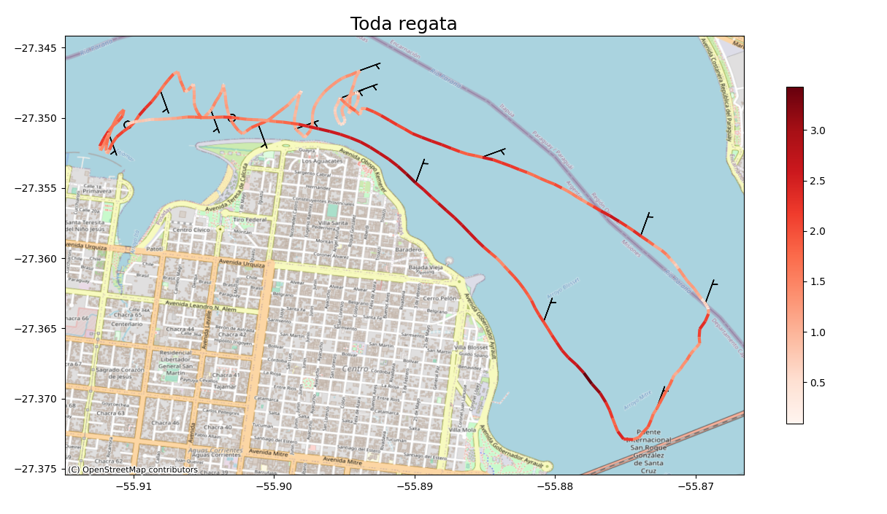

*Artigo publicado também no [linkedin](https://www.linkedin.com/pulse/combinando-duas-paix%2525C3%2525B5es-an%2525C3%2525A1lise-de-dados-e-velejar-felipe-%3FtrackingId=EAX4te6Dm9nK3%252BEixm%252F23w%253D%253D/?trackingId=EAX4te6Dm9nK3%2BEixm%2F23w%3D%3D).*

Olás! Tem algum tempo que gostaria de compartilhar com vocês um projeto pessoal, chamado "**Sailing Analysis**". Neste projeto, busco unir duas paixões: **análise de dados** e **velejar**. Através do poder da tecnologia e da ciência de dados, estou explorando maneiras de aprimorar minha performance em regatas e compreender os fatores que influenciam os resultados.

Para dar vida ao "Sailing Analysis", estou utilizando a linguagem de programação Python e uma variedade de bibliotecas especializadas. Vou guiar vocês através do processo que tenho seguido até agora:
1. 
2. Exportação de Dados: Começo exportando os dados das minhas regatas, salvos em formato GPX, que é um padrão amplamente utilizado para representar informações de GPS, ao PostGIS, um banco de dados espacial, para armazenar e gerenciar esses dados. No entanto, caso você não esteja familiarizado com o [PostGIS](http://postgis.net/), também é possível trabalhar com um formato [Geopackage](https://www.geopackage.org/).
2. Análise de Trajetória: Utilizando a biblioteca [MovingPandas](https://movingpandas.org/), desenvolvido pela [Anita Graser](https://www.linkedin.com/in/anita-graser-%F0%9F%8C%BB-95102530/?lipi=urn%3Ali%3Apage%3Ad_flagship3_pulse_read%3B3QvIyZu6Svaf%2BwNb7n1Rzw%3D%3D), converto os pontos da rota realizada (track points) em uma estrutura de dados chamada "*trajectory*". A partir disso posso calcular diversos atributos relevantes, como aceleração, diferença angular, direção e velocidade. Essas informações me ajudam a compreender melhor o desempenho do barco em diferentes momentos da regata.
3. Persistência de Dados: Após a análise da trajetória, persisto os dados no banco de dados PostGIS ou Geopackage. Essa etapa é fundamental para manter um registro completo das regatas e permitir análises futuras.
4. Dados Meteorológicos: Como as condições meteorológicas têm um papel crucial nas regatas, integro tais informações ao meu projeto. Através de duas fontes diferentes, obtenho dados meteorológicos relevantes. Primeiro, acesso a estação meteorológica mais próxima para obter informações atualizadas a cada hora. Além disso, utilizo um modelo meteorológico para obter previsões de vento para cada posição do barco ao longo da regata.
5. Visualização e Mapeamento: Por fim, utilizo as bibliotecas Pandas, Geopandas e Matplotlib para elaborar mapas detalhados das regatas. Esses mapas me permitem visualizar toda a rota ou partes específicas das regatas, com base nas horas de início e fim, junto com as infomações de condição do vento (figura 1).

Para tornar todo o processo mais eficiente e replicável, optei por usar tecnologias como Docker, que me permite criar um ambiente de desenvolvimento isolado e fácil de configurar. Além disso, utilizo o SQLAlchemy para mapear objetos Python ao banco de dados PostGIS e o Alembic para gerenciar as migrações do banco de dados.
Quanto aos dados meteorológicos, faço uso das APIs do Open Weather Map e do Meteostat, que me fornecem acesso a informações detalhadas sobre o clima.
Este projeto tem me proporcionado uma oportunidade única de combinar minhas paixões pessoais com habilidades técnicas. Através da análise de dados, estou ganhando insights valiosos sobre o meu desempenho na vela, identificando áreas de melhoria e descobrindo padrões que podem me ajudar a obter melhores resultados.
No futuro, planejo expandir o "Sailing Analysis" e compartilhar minhas descobertas com outros velejadores. Acredito que a análise de dados pode beneficiar toda a comunidade náutica, proporcionando uma compreensão mais profunda das estratégias de regata, das condições ideais de vento e de outros fatores importantes.
Se você também é apaixonado por velejar ou análise de dados, adoraria trocar experiências e ideias com você. Vamos nos conectar e impulsionar o potencial dessa combinação fascinante!
Para saber mais sobre o projeto "Sailing Analysis" e acompanhar o seu desenvolvimento, visite o repositório no GitHub: [Sailing Analysis](https://github.com/FelipeSBarros/SailingAnalysis).

Abraço e até breve!
